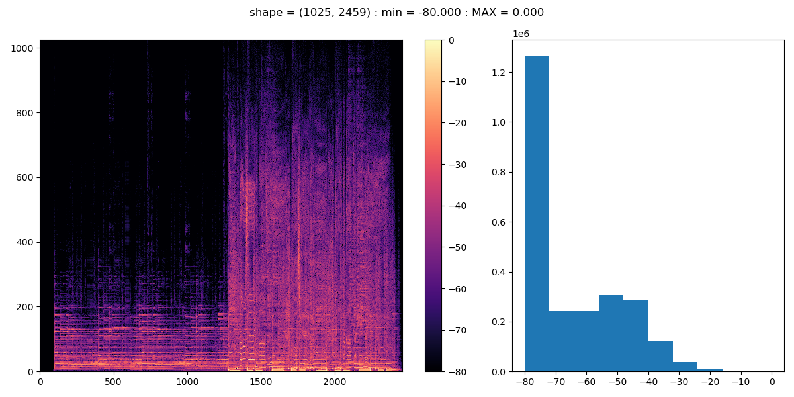

# numpy-viewer
## About
This program is a simple CLI tool that illustrates the contents of an npy file containing a two-dimensional matrix, it's common in image-related machine learning.

It can display not only simple 2D ndarrays (shape=(height, width)), but also 3D ndarrays (shape=(num_data, height, width)) and 4D ndarrays(shape=(num_group, num_data_per_group, height, width)).

## How to Use
1. set python environment. please use `env.yaml`
2. copy and edit `config_base.yaml`
3. Run `python main.py your_config.yaml`
